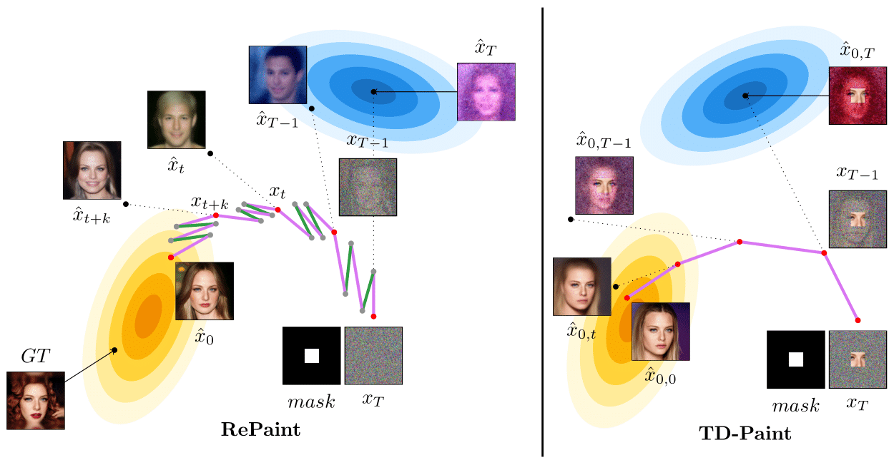

# TD-Paint: Faster Diffusion Inpainting Through Time-aware Pixel Conditioning

This repository is the official implementation of **TD-Paint: Faster Diffusion Inpainting Through Time-aware Pixel Conditioning**. 

This repository use code from [RePaint](https://github.com/andreas128/RePaint) and [Guided Diffusion](https://github.com/openai/guided-diffusion).




## Requirements
- python 3.10
- pytorch 2.2.1+cu121
- pytorch-lightning 2.2.1

To install requirements:

```setup
pip install -r requirements.txt
```

## Datasets
Download models to train using `download.sh`.
Unzip `gt_keep_mask.zip``
### CelebaHQ
Download the CelebaHQ dataset and extract it as:
```text
-CelebAMask-HQ/CelebA-HQ-img/
     |----1.jpg
     |----2.jpg
     ...
     |----3.jpg
```
### Imagenet1k
Download and prepare Imagenet1k dataset using `get_imagenet.sh``.
```text
imagenet1k/train
     |----n01440764/
          |----n01440764_1.JPEG
          ...          
     ...
imagenet1k/val
     |----n01440764/
          |----ILSVRC2012_val_00000293.JPEG
          ...     
     ...
```

## Training

To train the model(s) in the paper,
- read the fields in the yaml_conf and change what you need than change (paths, gpus, etc)
- for additional configuration, please read files in `conf/`
- run this command:
```bash
PARAMS=(
    dataset_params/data_params=celeba
    yaml_conf=["yaml_conf/train_base_celeba.yaml","yaml_conf/train_celeba.yaml"]
)
python train_diffusion.py ${PARAMS[@]}
```
```bash
PARAMS=(
    dataset_params/data_params=celeba
    yaml_conf=["yaml_conf/train_base_imagenet.yaml","yaml_conf/train_imagenet.yaml"]
)
python train_diffusion.py ${PARAMS[@]}
```

## Evaluation

To evaluate TD-Paint on CelebaHQ, or ImageNet,
- read the fields in the yaml_conf and change what you need than change (paths, gpus, etc)
- for additional configuration, please read files in `conf/`
- run this command:

```bash
PARAMS=(
    dataset_params/data_params=celeba
    yaml_conf=["yaml_conf/eval_base_celeba.yaml","yaml_conf/eval_celeba.yaml"]
)
python train_diffusion.py ${PARAMS[@]}
```

```bash
PARAMS=(
    dataset_params/data_params=celeba
    yaml_conf=["yaml_conf/eval_base_imagenet.yaml","yaml_conf/eval_imagenet.yaml"]
)
python train_diffusion.py ${PARAMS[@]}
```

## Checkpoints Models, Test Images, and Generated Images
Pre-trained checkpoints for CelebA-HQ, ImageNet1K, and Places datasets, along with test datasets, masks, and generated images, are available [here](https://nuage.insa-rouen.fr/index.php/s/xigWgtHnH8ErK3b).

**Important**:
- For CelebA-HQ masks: Black areas indicate regions to keep (`black_is_keep`).
- For ImageNet1K and Places masks: White areas indicate regions to keep (`white_is_keep`).
